Quick Start Guide for OU Users of EMERSE
================

## What is EMERSE?
 - Search engine for medical records
 - Like Google, but for clinical notes
 - Finds information in unstructured text
 - Helps with research, quality improvement, and clinical care

*EMERSE searches actual text in clinical notes, not just coded data*

---

## Part 1: Getting Into EMERSE

### Get Your Account

Before you can use EMERSE, you need access:

1. Contact your EMERSE administrator (email bbmc@ouhsc.edu)
1. Get IRB approval if doing research
1. Have OU Health credentials to log in on an OU Health machine/a machine on the OU Health network (including having Imprivata 2-factor authentication configured)

### Log In

1. Open your web browser
1. Go to the OU Health Campus EMERSE website ["oumlpappers01:8080/emerse"](oumlpappers01:8080/emerse)
1. Enter your username and password
1. Click **Login**

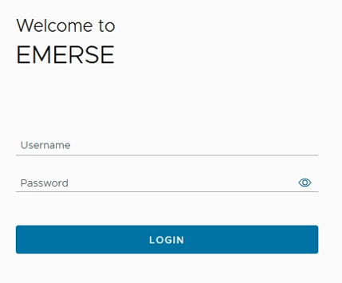

### Tell EMERSE Why You're Here (Attestation)

The first screen asks why you're using EMERSE today:

1. Choose ption relevant to your reason for use:
   - **Clinical Care** - Looking up patient information for treatment
   - **Quality Improvement** - Checking quality metrics
   - **Research Study** - Find your study in the list
   
1. Click on your selection

1. Click **Submit**

> **Note:** This gets recorded for security. If you need to change it, you'll have to log out and start over.

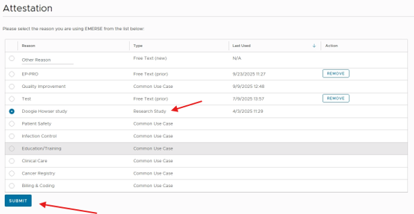

---

## Part 2: Understanding Search Logic (Searching for a Cohort)

Before we start searching, let's understand how EMERSE thinks about your search terms. Please note that the following logic applies to assembling a cohort of patients with the targeted terms present in their unstructured notes. The Boolean logic does not apply to individual notes (e.g., you will not be able to restrict to only NOTES containing references to all included terms).

### Basic Search Logic

EMERSE uses logical operators similar to database queries:

**OR** - Find patients with ANY of these terms
- Example: `diabetes OR "diabetes mellitus" OR DM`
- Finds patients mentioning any form of diabetes

**AND** - Find patients with ALL of these terms
- Example: `diabetes AND insulin`
- Only finds patients who have BOTH diabetes and insulin mentioned

**NOT** - Exclude patients with this term
- Example: `diabetes NOT gestational`
- Finds diabetes patients but excludes gestational diabetes

### How EMERSE Handles Logic with Colors

**Important concept:** In EMERSE, the color of your search terms determines the logic:
- **Same color** = OR (any of these)
- **Different colors** = AND (all of these)

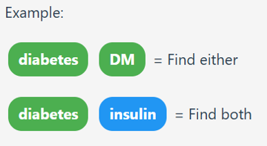

---

## Part 3: Your First Search - Finding Diabetic Patients on Insulin

Let's find patients who have diabetes AND are on insulin, but NOT those with just hyperglycemia.

### Choose Who to Search

1. Look at the top of the screen for the **Patients** button
1. Click **Patients** 
1. Select **All Local Patients**
1. You'll see "All Local Patients" appear at the top with a number (total patients in system)

### Enter Your Diabetes Terms (OR Logic)

1. Click the **Terms** button at the top
1. In the box "Enter Terms/Phrases (one at a time)":
1. Type: `diabetes`
1. Press **Enter**
1. You'll see "diabetes" appear as a colored bubble (let's say it's green)
1. Type: `DM`
1. Press **Enter** - it should also be green
1. Type: `diabetic`
1. Press **Enter** - should also be green

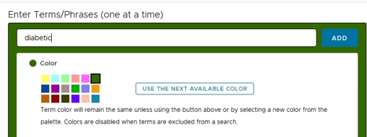
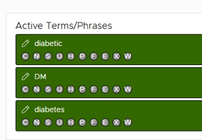

> **What this means:** Find patients with "diabetes" OR "DM" OR "diabetic"

### Add More Related Terms Using Synonyms

Let's make our search better by adding related terms:

1. Look for a **Synonyms** button under your "diabetes" bubble
1. Click **Synonyms**
1. A window pops up with suggestions like:
   - IDDM
   - NIDDM
   - Type 2 diabetes
   - Type 1 diabetes
1. The highlighted (colored) terms are selected
1. Click **Highlight None** first (to start fresh)
1. Click on 3-4 terms you want to include (they'll highlight)
1. Click **Add Highlighted Terms**
1. Close the synonyms window

### Add Insulin Terms (AND Logic)

Now we want patients who have diabetes AND are on insulin:

1. Type: `insulin`
1. **Before pressing Enter**, click a different color (like blue)
1. Press **Enter**
1. Add related insulin terms in the same blue color:
   - Type: `lantus` (select blue) → Enter
   - Type: `humalog` (select blue) → Enter
   - Type: `novolog` (select blue) → Enter

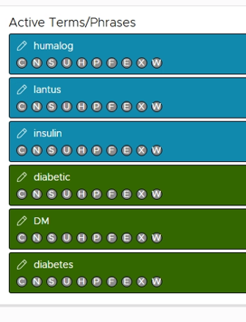

> **What this means:** Find patients with (diabetes OR DM OR diabetic) AND (insulin OR lantus OR humalog OR novolog)

### Exclude Hyperglycemia-Only Patients

To exclude certain patients, we'll use the Exclude feature:

1. Type: `gestational`
1. Look for the **Exclude Note** checkbox below the term entry
1. Check **Exclude Note**
1. Press **Enter**
1. The term appears with a special "X" indicator

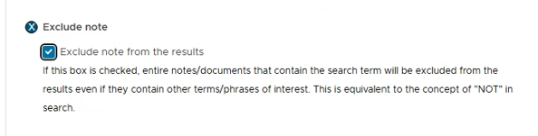
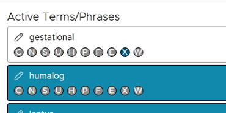

> **What this means:** Exclude any documents that mention gestational

### Review Your Search Logic

Your terms should now look like:
- 🟢 Green terms: `diabetes`, `DM`, `diabetic` (OR logic)
- 🔵 Blue terms: `insulin`, `lantus`, `humalog`, `novolog` (OR logic)
- ❌ Excluded: `gestational`

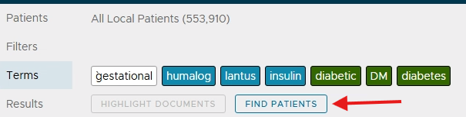

**Translation:** Find patients who have (any diabetes term) AND (any insulin term) but NOT gestational diabetes

### Run Your First Search

1. Click **Find Patients** (usually a green button)
1. Wait for results (this may take a few seconds)

### Understanding Your Results

You'll see four sections:

**Top Section - Patient Count:**
- Shows total number of patients found (Example: "Found 2,847 patients")

**Summaries Tab:**
- Shows snippets of text where your terms were found
- Helps verify you're finding the right things
- Only shows up to 100 snippets

**Demographics Tab:**
- Charts showing age, sex, race of found patients
- Useful for understanding your population

**Trends Tab:**
- Graph showing cases over time
- Helps spot patterns

---

## Part 4: Working with Your Found Patients

### Save Your Patient List
1. Click **Move to Temporary Patient List** to save patients to a working list
1. To save permanently:
   - Click **Save**
   - Enter a descriptive name like "Diabetes Patients on Insulin Nov 2024"
   - Add a description of search logic in 'Description' box
   - Click **Save**

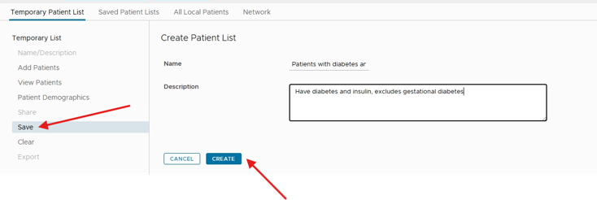

### List Types Explained:

- **Temporary Lists:** Deleted when you log out, cannot be shared
- **Saved Lists:** Permanent, can be shared with team members

### Look at Individual Patient Records (Highlight Documents)

Now let's review specific patient documents:

1. Make sure your patient list is selected
1. Click **Terms** if not already there
1. Your diabetes-related terms should still be visible
1. Click **Highlight Documents** (instead of Find Patients)
1. Wait for the results

### Navigate the Overview Table

You'll see a table where:

- Each **row** = one patient
- Each **column** = type of document (Progress Notes, Radiology, etc.)
- **Numbers** in cells = "matches found / total documents"

> Example: "5 of 23" means 5 documents mentioned your terms out of 23 total documents

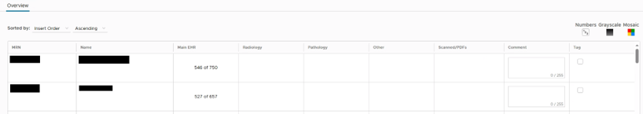

**Visual Options:**
- **Numbers:** Toggle to show counts for all cells
- **Grayscale:** Darker = more documents with hits
- **Mosaic:** Color grid showing which terms appear

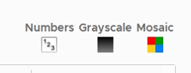
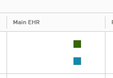

### Drill Down to See Actual Notes

1. Click on a 'Main EHR' cell in 'Overview' table
1. You'll see a list of documents with previews (Summaries)
1. Click on any document row to read the full note
1. Your search terms are highlighted in their assigned colors

> Hint: Use 'Mosaic' view to look for notes with specific terms or combinations of terms highlighted.

### Navigate Between Documents

While viewing a document:
- Click **Next Document** to move forward
- Click **Previous Document** to go back
- Click **Next Patient** to jump to the next person
- Or use keyboard shortcuts: 
  - `<` and `>` for documents
  - Arrow keys for patients

### Understanding Document Annotations

Above each document, you'll see options to view:

**Semantic Groups** (click to highlight):

- Drugs (medications)
- Disorders (diagnoses)
- Procedures
- Anatomy

**Annotations** (click to underline):

- Negation (red underline): "no chest pain"
- Uncertainty (purple underline): "possible diabetes"
- Non-patient (blue underline): "mother has diabetes"
- History (green underline): "history of MI"

---

## Part 5: Adding Filters to Narrow Your Search

Filters help you focus on specific subsets of patients or documents.

### Add a Date Filter

Let's find diabetes patients seen in the last year:

1. Click **Patients** → **All Local Patients** (start fresh)
1. Click **Filters** button at top
1. Look for **Encounter Dates** or **Document Dates**
1. Enter:
   - Start Date: One year ago
   - End Date: Today
1. Notice the filter appears at the top of screen

### Add Other Filters

Common filters include:
- **Patient Demographics:** Age, sex, race
- **Document Types:** Progress notes, discharge summaries, etc.
- **Departments:** Cardiology, emergency, etc.
- **Age at Document Date:** Patient's age when note was written

To apply:

1. Check boxes for what you want to include
1. Yellow bar appears next to active filter categories
1. Filter names show at top of screen

### Search with Filters Applied

1. Click **Terms**
1. Enter your search terms (e.g., `diabetes`)
1. Click **Find Patients**
1. Results now show only recent diabetes patients based on your filters

---

## Part 6: Searching a Single Patient's Chart

Let's find all mentions of medications for one specific patient:

### Create a Single Patient List

1. Click **Patients** → **Patient List** → **Add/Upload**
1. Enter one patient's MRN (medical record number)
1. Click **Add Patients**
1. Click **Done**
1. Click **Highlight Documents**

### Search for Medications

1. Click **Terms**
1. Clear any previous terms (click **Clear**)
1. Enter: `medication`
1. Click **Synonyms**
1. Select terms like: medicines, drugs, meds, prescriptions
1. Click **Add Highlighted Terms**
1. Click **Highlight Documents**

### Review Single Patient Results
- The overview shows where medications are mentioned across different document types
- Click cells to see specific documents
- All medication-related terms are highlighted

---

## Part 7: Advanced Search Using Boolean Operators

For more complex searches, use the **Advanced Terms** feature:

### Access Advanced Terms
1. Click **Terms** → **Advanced Terms** tab
1. You'll see a text box for complex queries

### Write a Boolean Query

Type exactly as shown (capitalization matters for operators):

```
(diabetes OR "diabetes mellitus" OR DM OR diabetic) AND (insulin OR metformin OR "oral hypoglycemic") NOT ("type 1" OR juvenile OR gestational)
```

**This searches for:**

- Patients with any diabetes term
- AND taking any diabetes medication
- NOT type 1, juvenile, or gestational diabetes

### Boolean Rules Reminder:

**Parentheses ()** - Group related terms

- `(diabetes OR DM)` - treats these as one unit

**Quotation marks ""** - Exact phrases

- `"diabetes mellitus"` - finds these words together
- `diabetes mellitus` - finds both words anywhere

**Operators must be UPPERCASE**
- `AND`, `OR`, `NOT` = correct
- `and`, `or`, `not` = searches for these words

---

## Part 8: Using Smart Search Features

### Using Negation Detection

EMERSE can identify when something is denied:

1. Enter term: `chest pain`
1. In options below the term entry, find **Negation**
1. Select: **"Find positive mentions only"**
1. This finds "chest pain" but NOT "denies chest pain" or "no chest pain"

### Other Smart Options

For each term, you can set:

- **Uncertainty:** Find only certain or uncertain mentions
- **Subject:** Patient only or family member mentions
- **History:** Current or historical mentions
- **Case-sensitive:** Match exact capitalization (e.g., "ALL" for acute lymphoblastic leukemia)
- **Proximity:** Find two words within X words of each other
- **Fuzzy Match:** Find similar spellings/misspellings

---

## Part 9: Practical Search Patterns

### Common Search Patterns You Can Copy:

**Diabetes with Complications:**
```
(diabetes OR diabetic OR DM) AND (neuropathy OR retinopathy OR nephropathy OR "kidney disease" OR "eye disease" OR "nerve damage")
```

**Cancer Staging:**
```
("breast cancer" OR "breast carcinoma") AND ("stage 3" OR "stage III" OR "stage 4" OR "stage IV" OR metastatic OR advanced)
```

**Medication Allergies:**
```
(allergy OR allergic OR "adverse reaction") AND (penicillin OR amoxicillin OR augmentin OR cephalosporin)
```

**Post-operative Complications:**
```
(surgery OR surgical OR operation OR post-op) AND (infection OR bleeding OR hemorrhage OR dehiscence OR complication)
```

---

## Part 10: Saving and Sharing Your Work

### Save Your Search Terms
1. Click **Save** under your terms
1. Name it descriptively (e.g., "Controlled HTN on ACE inhibitors")
1. Add description of the logic used
1. Click **Save**

### Share with Colleagues
For Saved Patient Lists:
1. Click **Sharing** for the list
1. Enter usernames of team members
1. They can view but not modify the list

For Saved Terms:
1. Click **Share** tab
1. Add specific users or share with all
1. Others can use but not change your terms

### Export Results
For Saved Patient Lists:
1. Click **Export**
1. Set a password for the Excel file
1. File includes patient info, demographics, any comments/tags
1. Can import into REDCap or other systems

---

## Quick Reference Card

### Main Navigation Buttons:
- **Patients** - Choose who to search
- **Terms** - Enter what to search for
- **Filters** - Narrow your search
- **Find Patients** - Search for patients (green button)
- **Highlight Documents** - Review documents (blue button)

### Search Modes Explained:
- **Find Patients** = Looking for patients with certain conditions across all patients or within a list
- **Highlight Documents** = Reviewing known patients' charts with terms highlighted

### Color-Based Logic:
- 🟢 Same Color = OR
- 🟢 🔵 Different Colors = AND
- ❌ Exclude = NOT

### Boolean Logic (Advanced Terms):
- `term1 OR term2` = Either term
- `term1 AND term2` = Both terms required
- `term1 NOT term2` = First but not second
- `(group1) AND (group2)` = Grouping
- `"exact phrase"` = Words together

### Keyboard Shortcuts:
- `<` and `>` = Previous/next document
- `←` and `→` = Previous/next patient
- Click column headers = Sort tables
- Hold 'X' key = Delete multiple terms
- Hold 'V' key = Paste term settings

---

## Troubleshooting Your Searches

### Too Many Results?
- Add more AND conditions (different colors)
- Use Exclude Note for unwanted terms
- Add date or department filters
- Be more specific with terms
- Use negation settings (positive mentions only)

### Too Few Results?
- Add more OR variations (same color)
- Check for common abbreviations
- Remove restrictive filters
- Use Synonyms feature for more terms
- Try fuzzy matching for misspellings

### Wrong Context?
- Use Negation settings (positive only)
- Exclude common false positives
- Add context terms as AND conditions
- Check uncertainty settings
- Review subject settings (patient vs. family)

### System Issues?
- Don't use browser back button - use EMERSE navigation
- If terms won't add, check for special characters
- If search fails, try simpler terms first
- Clear cache if interface seems stuck

---

## Your Next Steps

1. **Practice the patterns** above with your own searches
1. **Save successful searches** as templates for reuse
1. **Share search strategies** with colleagues
1. **Document your logic** for research reproducibility

**Remember:** 
- Good searches combine the right terms with the right logic
- Start simple, test your results, then refine
- EMERSE finds the information, but you still review it in context
- Not everything highlighted will be relevant to your specific needs

---

*Congratulations! You now understand EMERSE's search logic and can build complex, accurate searches for both research and clinical use.*